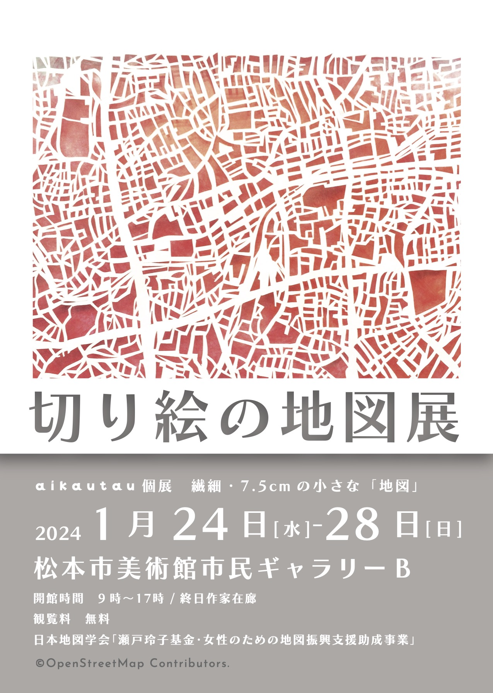

# 日本地図学会「瀬戸玲子基金・女性のための地図振興支援助成事業」「切り絵の地図展 －aikautau 個展　繊細・7.5cm の小さな「地図」－」

## 「切り絵の地図展」
－aikautau 個展　繊細・7.5cm の小さな「地図」－

* 開催日：2024年1月24日(水)〜2024年1月28日(日)
* 会場：松本市美術館 市民ギャラリーB (長野県松本市中央４丁目２−２２)
* 開館時間：9時〜17時（会期中は 終日作家在廊予定）
* 閲覧料 無料
※ 本個展は、日本地図学会「瀬戸玲子基金・女性のための地図振興支援助成事業」の対象事業です。

[「切り絵の地図屋」ウェブサイト](https://aikautau.work/)
[https://aikautau.work/](https://aikautau.work/)

